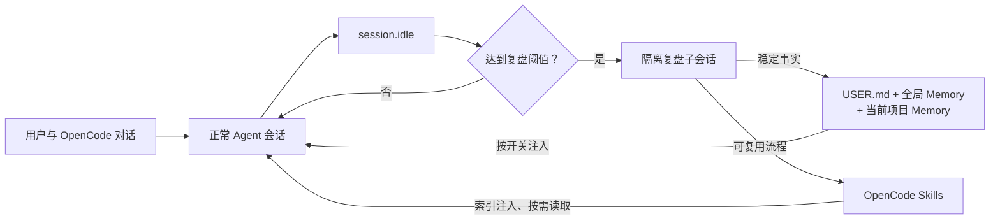

# OpenCode 持续学习插件

<div align="center">

为 OpenCode 提供分层长期记忆、历史会话检索、学习图谱、可审批后台写入、外部记忆和隔离式自动复盘。


</div>

## 功能

- 把用户身份和长期偏好保存到全局 `USER.md`。
- 把跨项目都适用的环境事实和约定保存到全局 `MEMORY.md`。
- 按项目根目录隔离架构、命令、约束和持久决策，避免不同项目互相污染。
- 把经过验证的可复用流程保存为 OpenCode 原生 `SKILL.md`。
- 在会话达到回合数或工具调用阈值后，通过隔离子会话自动复盘。
- 以 SQLite FTS5 索引会话正文，提供发现、整段读取和围绕命中消息滚动三种历史检索方式。
- 记录 Memory、Skill、审批和外部同步事件，并生成学习时间线及 Memory–Skill 关系图。
- 可将后台复盘写入暂存到持久审批队列，由用户批准或拒绝后再执行。
- 可选择 Mem0 或 Honcho 作为外部记忆 Provider，自动同步完成回合并按当前问题召回。
- 支持把 Skill 安全移动到可恢复归档，后台只能归档自己管理且已被其他 Skill 吸收的内容。
- 提供 `/learning-settings` 原生 TUI 面板，直接管理全部 20 个设置，不产生模型调用。
- 可单独关闭历史记忆注入，同时继续复盘和落盘；也可通过总开关完全停用学习模式。
- 记录自动生成 Skill 的所有权和内容哈希，防止后台覆盖用户手写或手动修改的 Skill。
- 对凭据特征、提示注入内容、并发写入、文件格式漂移和容量上限进行防护。

插件不会训练或修改模型权重。所谓“学习”是把稳定事实和可复用方法持久化到本地文件，让后续 OpenCode 会话按需使用。

## 工作方式



普通对话只会取得全局记忆和当前项目的项目记忆。自动复盘不会把提示、推理或内部回答追加到原会话；后台 Agent 只能调用三个学习工具，不能编辑项目文件、执行终端命令或访问网络。

## 快速开始

### 1. 获取源码

```bash
git clone git@github.com:AscorbicAcid-8848/opencode-continuous-learning.git
cd opencode-continuous-learning
```

当前仓库是私有仓库，克隆账号需要先取得访问权限并配置 GitHub SSH 身份。

### 2. 安装插件

Linux 或 macOS：

```bash
bash ./scripts/install.sh
```

Windows PowerShell：

```powershell
powershell -ExecutionPolicy Bypass -File .\scripts\install.ps1
```

安装脚本会：

1. 把 `src/` 整体复制到 OpenCode 全局配置目录下的 `continuous-learning-plugin/src/`；
2. 生成插件入口 `plugins/continuous-learning.ts`（从运行时目录导入并导出服务端插件）；
3. 生成 `continuous-learning-plugin/package.json`（声明依赖和导出映射）；
4. 安装 `/learn` 和 `/learn-review` 命令；
5. 注册 `/learning-settings` 原生设置面板，同时保留已有 TUI 插件；
6. 安装可选 Honcho Provider 所需的官方 TypeScript SDK；
7. 首次安装时创建默认配置，升级时保留现有配置；
8. 备份即将被替换的文件，并清理旧版 `/learning-mode` 命令。

设置面板要求 OpenCode 1.18.15 或更高版本。安装完成后完全退出并重新启动 OpenCode。

### 3. 打开设置面板

在 OpenCode 输入：

```text
/learning-settings
```

也可以打开命令面板，搜索“持续学习设置”。面板不会向模型发送消息；布尔开关选中后立即保存，数值项会先校验合法范围。服务端在下一次提示注入、学习工具调用或会话空闲检查前自动重载配置，无需重启。

## 使用示例

让插件记住稳定偏好或环境事实：

```text
请记住：我更喜欢使用 Bun 运行 TypeScript 测试。
```

主动调查并沉淀一个可复用流程：

```text
/learn 如何在这个项目中可靠地执行数据库迁移
```

立即复盘当前会话：

```text
/learn-review
```

只想继续学习和落盘、但不让历史记忆影响普通对话时，在设置面板关闭“在对话中使用记忆”。想停止注入、复盘和学习读写时，关闭“持续学习总开关”。两种操作都不会删除已经保存的数据。

## 内置命令

| 命令 | 用途 |
|---|---|
| `/learning-settings` | 打开原生设置面板，不调用模型 |
| `/learning-config` | `/learning-settings` 的等价别名 |
| `/learning-pending` | 查看、批准或拒绝后台暂存写入，不调用模型 |
| `/learning-journey` | 浏览学习时间线，不调用模型 |
| `/learn <主题>` | 调研主题并创建或更新用户所有的 Skill |
| `/learn-review` | 立即复盘当前会话中已经完成并验证的内容 |

旧版 `/learning-mode` Slash 命令已经移除。总开关统一在设置面板中操作；底层 `learning_mode` 工具仅作为内部控制接口保留。

## 学习工具

| 工具 | 用途 |
|---|---|
| `learning_memory` | 查看、添加、替换或删除用户、全局和项目三个作用域的事实 |
| `learning_skill` | 列出、读取、创建、更新或归档删除标准 `SKILL.md` |
| `session_search` | 全文搜索、浏览、读取或滚动历史 OpenCode 会话 |
| `learning_pending` | 列出、查看、批准或拒绝后台写入 |
| `learning_journey` | 返回学习时间线或 Memory–Skill 图谱 |
| `learning_external_memory` | 查看或搜索 Mem0/Honcho 外部记忆 |
| `learning_status` | 查看配置、存储位置、条目数量和复盘检查点 |
| `learning_mode` | 查询或切换持续学习总开关 |

这些工具通常由 Agent 自动调用。前台写入可以要求 OpenCode 权限确认；后台复盘只允许 `learning_memory`、`learning_skill` 和 `learning_status`。

## 自动复盘

自动复盘同时要求：

1. `enabled` 为 `true`；
2. `autoReview` 为 `true`；
3. 自上次成功复盘后，用户回合数或工具调用数达到对应阈值。

默认累计 10 个用户回合或 15 次已完成/失败的工具调用后触发。插件会清洗会话转录、限制输入长度、创建隔离子会话，并只允许保存真正稳定的事实或可复用流程。复盘成功后才推进检查点；失败后按冷却时间重试。

修改阈值后，当前 OpenCode 进程会在下一次 `session.idle` 检查时使用新值。已经运行中的复盘不会被设置面板中断。

## 配置

配置文件位于：

```text
~/.config/opencode/continuous-learning/config.json
```

推荐通过 `/learning-settings` 修改。也可以直接编辑 JSON；未知字段会在面板保存和恢复默认值时保留。

| 设置 | 默认值 | 作用 |
|---|---:|---|
| `enabled` | `true` | 持续学习总开关 |
| `memoryContextEnabled` | `true` | 是否向普通对话注入已有记忆和 Skill 索引 |
| `autoReview` | `true` | 是否允许后台自动复盘 |
| `sessionSearchMaxSessions` | `200` | 首次搜索最多补建多少个当前项目旧会话 |
| `backgroundWriteApproval` | `false` | 后台复盘写入是否先进入审批队列 |
| `externalMemoryProvider` | `builtin` | `builtin`、`mem0` 或 `honcho` |
| `externalMemoryAutoSync` | `true` | 选用外部 Provider 后是否同步完成回合 |
| `externalMemoryTopK` | `5` | 每次外部记忆召回条数 |
| `externalMemoryTimeoutMs` | `3000` | 外部 Provider 请求超时毫秒数 |
| `memoryEveryTurns` | `10` | Memory 复盘的用户回合阈值 |
| `skillEveryToolCalls` | `15` | Skill 复盘的工具调用阈值 |
| `retryCooldownMinutes` | `30` | 失败后的重试冷却分钟数 |
| `maxConcurrentReviews` | `2` | 同时运行的后台复盘上限 |
| `maxTranscriptChars` | `60000` | 复盘转录最大字符数 |
| `memoryCharLimit` | `2200` | 全局 Memory 字符上限 |
| `projectMemoryCharLimit` | `4000` | 单个项目 Memory 字符上限 |
| `userCharLimit` | `1375` | 用户画像字符上限 |
| `foregroundWriteApproval` | `true` | 前台学习写入是否请求权限确认 |
| `deleteReviewSessions` | `true` | 完成后是否删除内部复盘会话 |
| `showNotifications` | `true` | 是否显示学习通知 |

常见组合：

| 使用方式 | 配置 |
|---|---|
| 开启全部能力 | `enabled=true`、`memoryContextEnabled=true`、`autoReview=true` |
| 学习但不影响普通对话 | `enabled=true`、`memoryContextEnabled=false` |
| 只主动学习，不后台调用模型 | `enabled=true`、`autoReview=false` |
| 完全关闭 | `enabled=false` |

### 历史检索、审批与学习图谱

安装并启用插件后，历史会话检索、Learning Journey 和 Skill 可恢复归档始终可用，不再设置各自的功能开关。

`session_search` 的调用形状参考 Hermes Agent：不传参数浏览最近会话；传 `query` 做全文发现；只传 `session_id` 读取会话；同时传 `session_id` 与 `around_message_id` 围绕命中位置滚动。首次搜索会通过 OpenCode API 补建当前项目旧会话索引，之后每次 `session.idle` 增量更新。全局索引会逐步汇集插件在不同项目中实际运行和索引过的会话，但 OpenCode 当前会话列表 API 不允许一个项目实例枚举其他项目，所以从未被本插件打开过的其他项目不会凭空导入。

开启 `backgroundWriteApproval` 后，后台 reviewer 的 Memory/Skill 写入不会直接落盘，而会保存到 `pending/`。使用 `/learning-pending` 审阅，批准时插件重新执行当前版本的安全校验，拒绝或批准后记录进入 `pending/history/`。前台主动写入仍由 `foregroundWriteApproval` 控制。

使用 `/learning-journey` 可直接浏览事件时间线；Agent 还可用 `learning_journey(action="graph")` 取得当前 Memory 与 Skill 节点、词法关联边和按时间连接的学习轨迹。这个 Graph 是按 Hermes Journey 的现有学习可视化思路实现的本地关系图，不是向量数据库或自动推理型知识图谱。

### 外部 Memory Provider

面板将“外部记忆 Provider”从 `builtin` 改成 `mem0` 或 `honcho` 后，插件会在当前问题进入模型前召回相关内容，并在一轮成功完成后的 `session.idle` 同步用户/助手文本。每个 Provider 的最后成功同步消息 ID 会保存在 SQLite 中，重启 OpenCode 不会重复上传同一回合。密钥只读取环境变量：

```bash
# Mem0 Platform
export MEM0_API_KEY="..."
export MEM0_USER_ID="opencode-user"       # 可选
export MEM0_AGENT_ID="opencode"           # 可选

# 自托管 Mem0；设置后使用 /search 与 /memories
export MEM0_HOST="http://localhost:8888"

# Honcho
export HONCHO_API_KEY="..."
export HONCHO_URL="https://api.honcho.dev" # 自托管时替换；可选
export HONCHO_WORKSPACE_ID="opencode-continuous-learning"
export HONCHO_USER_ID="opencode-user"
export HONCHO_AGENT_ID="opencode-assistant"
```

Mem0 Platform 使用官方 V3 `memories/search` 与 `memories/add` API；自托管 Mem0 使用 OSS REST 路径。Honcho 使用官方 `@honcho-ai/sdk` 2.2.0。插件状态只显示凭据来源和是否已配置，不回显密钥。外部服务不可用时按配置超时并记录警告，不阻塞本地 Memory/Skill 的正常使用。

## 数据位置与作用域

```text
~/.local/share/opencode/continuous-learning/
├── MEMORY.md                              # 跨项目环境事实和长期约定
├── USER.md                                # 用户身份和长期偏好
├── projects/<项目名>-<路径哈希>/MEMORY.md # 当前项目的持久事实
├── review-state.json                      # 自动复盘检查点
├── session-search.sqlite                  # 历史会话与 FTS5 全文索引
├── learning-journey.json                  # 学习事件时间线
├── pending/                               # 待审批写入及批准/拒绝审计
└── skill-provenance/                      # 自动 Skill 的所有权记录

~/.config/opencode/skills/<name>/SKILL.md  # OpenCode 原生 Skill
~/.config/opencode/skills/.continuous-learning-archive/ # 可恢复 Skill 归档
```

插件本身全局安装，因此所有 OpenCode 项目都能使用；记忆数据则按用户、全局和项目三层管理。项目分区由规范化项目根路径生成，同名但路径不同的项目不会共用项目 Memory。

新写入的 Skill 可立即通过 `learning_skill view` 读取。OpenCode 1.18.15 的原生 Skill 索引在进程启动时扫描，因此要让原生 `skill` 工具也显示新 Skill，需要重启 OpenCode。

## 安全与并发

- 不把令牌、密码、私钥、临时凭据或未经验证的猜测保存为记忆。
- 对常见凭据格式和提示注入特征进行内容扫描。
- 使用原子写入和跨进程锁，避免多个 OpenCode 进程同时更新造成文件损坏。
- Memory 文件格式出现人工漂移时拒绝覆盖，保留原始内容供用户处理。
- 后台只能更新由后台创建、仍标记为自动管理且内容哈希未被人工修改的 Skill。
- 用户手工修改自动 Skill 或在前台更新一次后，后台立即失去覆盖权。
- 自动复盘子会话与原会话隔离，并限制可用工具。
- 审批队列保存完整待执行参数；批准时仍重新执行内容扫描、容量、所有权和路径检查。
- 外部 Provider 密钥不写入配置或状态输出，只从环境变量读取。
- 会话检索会把用户、助手文本和工具调用摘要保存到本机 SQLite；它不会自动上传，但应按聊天记录同等级别保护该文件。

内容扫描和权限边界不能替代人工判断。模式开启且“在对话中使用记忆”打开时，相关记忆会进入模型上下文。

## 测试

安装依赖：

```bash
npm install
```

运行测试与 TypeScript 检查：

```bash
npm test
npm run typecheck
```

当前测试还覆盖 FTS5 发现/浏览/读取/滚动、审批队列重启持久性、批准与拒绝审计、Journey 图谱、可恢复 Skill 归档、Mem0 官方请求形状和后台审批集成。

GitHub Actions 会在每次 push 和 pull request 时自动执行相同检查。

## 项目结构

```text
opencode-continuous-learning/
├── src/
│   ├── core.ts                    # 配置、存储、校验、锁和复盘数据处理
│   ├── advanced.ts                # FTS5、审批队列、Journey/Graph 和外部 Provider
│   ├── plugin.ts                  # 服务端插件、工具、注入和自动复盘编排
│   └── tui.ts                     # /learning-settings 原生设置面板
├── commands/
│   ├── learn.md                   # 主动学习命令模板
│   └── learn-review.md            # 立即复盘命令模板
├── config/default.json            # 新安装默认配置
├── scripts/
│   ├── install.sh                 # Linux / macOS 安装脚本
│   └── install.ps1                # Windows 安装脚本
├── tests/                         # 核心、插件编排和 TUI 测试
├── docs/
│   ├── 用户手册.md
│   ├── 实现原理.md
│   └── 项目结构与调用关系教程.md
├── package.json
└── tsconfig.json
```

`src/` 是运行实现的唯一源码。安装脚本在安装时自动生成插件入口和 `package.json`，把 `src/` 整体部署到 OpenCode 全局配置目录，不会把测试或开发依赖复制进去。

## 能力边界

- 学习结果是外部 Markdown 和 JSON 文件，不会微调模型或修改模型权重。
- 自动复盘只整理已经发生的会话，不会替用户重新执行任务或主动调查外部资料。
- `/learn` 可以使用当前 Agent 已有工具进行调查，但是否可靠仍取决于资料质量和验证过程。
- `memoryContextEnabled=false` 只停止上下文注入，不停止学习和落盘；`enabled=false` 才会关闭整套学习读写与自动复盘。
- 项目 Memory 按项目根路径隔离；全局 Memory、用户画像和 Skills 对当前用户的所有 OpenCode 项目可见。
- `externalMemoryProvider=builtin`（默认）时不向外部记忆服务上传内容。选择 `mem0` 或 `honcho` 且保持自动同步开启后，完成回合会发送给对应服务；请先确认其隐私与数据保留策略。
- 本地学习数据不会自动加密或备份，也不会上传到这个代码仓库。

## 开发约定

- 修改运行逻辑时同步更新测试、默认配置和用户手册。
- 不把 `node_modules`、本地 Memory、用户画像、复盘状态、安装备份或凭据提交到仓库。
- 提交前至少运行 `npm test`、`npm run typecheck` 和 `git diff --check`。
- 提交信息建议遵循 Conventional Commits，例如：

```text
feat(memory): add project-scoped persistent facts
fix(tui): keep resource limit brackets visible
docs(readme): expand installation and configuration guide
```

更完整的操作说明见[用户手册](docs/用户手册.md)，内部设计与安全边界见[实现原理](docs/实现原理.md)，新功能的 Hermes 源码映射见[Hermes 功能对照与实现说明](docs/Hermes功能对照与实现说明.md)。如果希望先理解程序入口、项目分层、对象、方法和完整调用链，再进入源码，请阅读[项目结构与调用关系教程](docs/项目结构与调用关系教程.md)。
