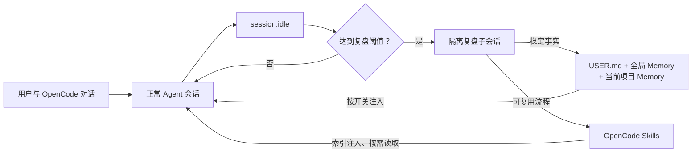

# OpenCode 持续学习插件

<div align="center">

为 OpenCode 提供分层长期记忆、用户画像、项目记忆、可复用 Skill 和隔离式自动复盘。


</div>

## 功能

- 把用户身份和长期偏好保存到全局 `USER.md`。
- 把跨项目都适用的环境事实和约定保存到全局 `MEMORY.md`。
- 按项目根目录隔离架构、命令、约束和持久决策，避免不同项目互相污染。
- 把经过验证的可复用流程保存为 OpenCode 原生 `SKILL.md`。
- 在会话达到回合数或工具调用阈值后，通过隔离子会话自动复盘。
- 提供 `/learning-settings` 原生 TUI 面板，直接管理全部 14 个设置，不产生模型调用。
- 可单独关闭历史记忆注入，同时继续复盘和落盘；也可通过总开关完全停用学习模式。
- 记录自动生成 Skill 的所有权和内容哈希，防止后台覆盖用户手写或手动修改的 Skill。
- 对凭据特征、提示注入内容、并发写入、文件格式漂移和容量上限进行防护。

插件不会训练或修改模型权重。所谓“学习”是把稳定事实和可复用方法持久化到本地文件，让后续 OpenCode 会话按需使用。

## 工作方式



普通对话只会取得全局记忆和当前项目的项目记忆。自动复盘不会把提示、推理或内部回答追加到原会话；后台 Agent 只能调用三个学习工具，不能编辑项目文件、执行终端命令或访问网络。

## 快速开始

### 1. 获取源码

```bash
git clone git@github.com:AscorbicAcid-8848/opencode-continuous-learning.git
cd opencode-continuous-learning
```

当前仓库是私有仓库，克隆账号需要先取得访问权限并配置 GitHub SSH 身份。

### 2. 安装插件

Linux 或 macOS：

```bash
bash ./scripts/install.sh
```

Windows PowerShell：

```powershell
powershell -ExecutionPolicy Bypass -File .\scripts\install.ps1
```

安装脚本会：

1. 把服务端插件和 TUI 设置面板复制到 OpenCode 全局配置目录；
2. 安装 `/learn` 和 `/learn-review` 命令；
3. 注册 `/learning-settings` 原生设置面板，同时保留已有 TUI 插件；
4. 首次安装时创建默认配置，升级时保留现有配置；
5. 备份即将被替换的文件，并清理旧版 `/learning-mode` 命令。

设置面板要求 OpenCode 1.18.15 或更高版本。安装完成后完全退出并重新启动 OpenCode。

### 3. 打开设置面板

在 OpenCode 输入：

```text
/learning-settings
```

也可以打开命令面板，搜索“持续学习设置”。面板不会向模型发送消息；布尔开关选中后立即保存，数值项会先校验合法范围。服务端在下一次提示注入、学习工具调用或会话空闲检查前自动重载配置，无需重启。

## 使用示例

让插件记住稳定偏好或环境事实：

```text
请记住：我更喜欢使用 Bun 运行 TypeScript 测试。
```

主动调查并沉淀一个可复用流程：

```text
/learn 如何在这个项目中可靠地执行数据库迁移
```

立即复盘当前会话：

```text
/learn-review
```

只想继续学习和落盘、但不让历史记忆影响普通对话时，在设置面板关闭“在对话中使用记忆”。想停止注入、复盘和学习读写时，关闭“持续学习总开关”。两种操作都不会删除已经保存的数据。

## 内置命令

| 命令 | 用途 |
|---|---|
| `/learning-settings` | 打开原生设置面板，不调用模型 |
| `/learning-config` | `/learning-settings` 的等价别名 |
| `/learn <主题>` | 调研主题并创建或更新用户所有的 Skill |
| `/learn-review` | 立即复盘当前会话中已经完成并验证的内容 |

旧版 `/learning-mode` Slash 命令已经移除。总开关统一在设置面板中操作；底层 `learning_mode` 工具仅作为内部控制接口保留。

## 学习工具

| 工具 | 用途 |
|---|---|
| `learning_memory` | 查看、添加、替换或删除用户、全局和项目三个作用域的事实 |
| `learning_skill` | 列出、读取、创建或更新标准 `SKILL.md` |
| `learning_status` | 查看配置、存储位置、条目数量和复盘检查点 |
| `learning_mode` | 查询或切换持续学习总开关 |

这些工具通常由 Agent 自动调用。前台写入可以要求 OpenCode 权限确认；后台复盘只允许使用前三个工具。

## 自动复盘

自动复盘同时要求：

1. `enabled` 为 `true`；
2. `autoReview` 为 `true`；
3. 自上次成功复盘后，用户回合数或工具调用数达到对应阈值。

默认累计 10 个用户回合或 15 次已完成/失败的工具调用后触发。插件会清洗会话转录、限制输入长度、创建隔离子会话，并只允许保存真正稳定的事实或可复用流程。复盘成功后才推进检查点；失败后按冷却时间重试。

修改阈值后，当前 OpenCode 进程会在下一次 `session.idle` 检查时使用新值。已经运行中的复盘不会被设置面板中断。

## 配置

配置文件位于：

```text
~/.config/opencode/continuous-learning/config.json
```

推荐通过 `/learning-settings` 修改。也可以直接编辑 JSON；未知字段会在面板保存和恢复默认值时保留。

| 设置 | 默认值 | 作用 |
|---|---:|---|
| `enabled` | `true` | 持续学习总开关 |
| `memoryContextEnabled` | `true` | 是否向普通对话注入已有记忆和 Skill 索引 |
| `autoReview` | `true` | 是否允许后台自动复盘 |
| `memoryEveryTurns` | `10` | Memory 复盘的用户回合阈值 |
| `skillEveryToolCalls` | `15` | Skill 复盘的工具调用阈值 |
| `retryCooldownMinutes` | `30` | 失败后的重试冷却分钟数 |
| `maxConcurrentReviews` | `2` | 同时运行的后台复盘上限 |
| `maxTranscriptChars` | `60000` | 复盘转录最大字符数 |
| `memoryCharLimit` | `2200` | 全局 Memory 字符上限 |
| `projectMemoryCharLimit` | `4000` | 单个项目 Memory 字符上限 |
| `userCharLimit` | `1375` | 用户画像字符上限 |
| `foregroundWriteApproval` | `true` | 前台学习写入是否请求权限确认 |
| `deleteReviewSessions` | `true` | 完成后是否删除内部复盘会话 |
| `showNotifications` | `true` | 是否显示学习通知 |

常见组合：

| 使用方式 | 配置 |
|---|---|
| 开启全部能力 | `enabled=true`、`memoryContextEnabled=true`、`autoReview=true` |
| 学习但不影响普通对话 | `enabled=true`、`memoryContextEnabled=false` |
| 只主动学习，不后台调用模型 | `enabled=true`、`autoReview=false` |
| 完全关闭 | `enabled=false` |

## 数据位置与作用域

```text
~/.local/share/opencode/continuous-learning/
├── MEMORY.md                              # 跨项目环境事实和长期约定
├── USER.md                                # 用户身份和长期偏好
├── projects/<项目名>-<路径哈希>/MEMORY.md # 当前项目的持久事实
├── review-state.json                      # 自动复盘检查点
└── skill-provenance/                      # 自动 Skill 的所有权记录

~/.config/opencode/skills/<name>/SKILL.md  # OpenCode 原生 Skill
```

插件本身全局安装，因此所有 OpenCode 项目都能使用；记忆数据则按用户、全局和项目三层管理。项目分区由规范化项目根路径生成，同名但路径不同的项目不会共用项目 Memory。

新写入的 Skill 可立即通过 `learning_skill view` 读取。OpenCode 1.18.15 的原生 Skill 索引在进程启动时扫描，因此要让原生 `skill` 工具也显示新 Skill，需要重启 OpenCode。

## 安全与并发

- 不把令牌、密码、私钥、临时凭据或未经验证的猜测保存为记忆。
- 对常见凭据格式和提示注入特征进行内容扫描。
- 使用原子写入和跨进程锁，避免多个 OpenCode 进程同时更新造成文件损坏。
- Memory 文件格式出现人工漂移时拒绝覆盖，保留原始内容供用户处理。
- 后台只能更新由后台创建、仍标记为自动管理且内容哈希未被人工修改的 Skill。
- 用户手工修改自动 Skill 或在前台更新一次后，后台立即失去覆盖权。
- 自动复盘子会话与原会话隔离，并限制可用工具。

内容扫描和权限边界不能替代人工判断。模式开启且“在对话中使用记忆”打开时，相关记忆会进入模型上下文。

## 测试

安装依赖：

```bash
npm install
```

运行测试与 TypeScript 检查：

```bash
npm test
npm run typecheck
```

当前测试覆盖配置校验和热重载、原子持久化、并发写入、项目隔离、内容安全、Memory 格式漂移、Skill 所有权、复盘阈值、转录限制、隔离工具白名单、成功检查点、总开关和 TUI 设置面板。

GitHub Actions 会在每次 push 和 pull request 时自动执行相同检查。

## 项目结构

```text
opencode-continuous-learning/
├── src/
│   ├── core.ts                    # 配置、存储、校验、锁和复盘数据处理
│   ├── plugin.ts                  # 服务端插件、工具、注入和自动复盘编排
│   └── tui.ts                     # /learning-settings 原生设置面板
├── commands/
│   ├── learn.md                   # 主动学习命令模板
│   └── learn-review.md            # 立即复盘命令模板
├── config/default.json            # 新安装默认配置
├── install/
│   ├── continuous-learning.ts     # 部署后的 OpenCode 插件入口
│   └── plugin-package.json        # 本地 TUI 插件清单
├── scripts/
│   ├── install.sh                 # Linux / macOS 安装脚本
│   └── install.ps1                # Windows 安装脚本
├── tests/                         # 核心、插件编排和 TUI 测试
├── docs/
│   ├── 用户手册.md
│   ├── 实现原理.md
│   └── 项目结构与调用关系教程.md
├── package.json
└── tsconfig.json
```

`src/` 是运行实现的唯一源码。安装脚本负责把服务端入口、运行模块、TUI 面板、命令和用户手册部署到 OpenCode 全局配置目录，不会把测试或开发依赖复制进去。

## 能力边界

- 学习结果是外部 Markdown 和 JSON 文件，不会微调模型或修改模型权重。
- 自动复盘只整理已经发生的会话，不会替用户重新执行任务或主动调查外部资料。
- `/learn` 可以使用当前 Agent 已有工具进行调查，但是否可靠仍取决于资料质量和验证过程。
- `memoryContextEnabled=false` 只停止上下文注入，不停止学习和落盘；`enabled=false` 才会关闭整套学习读写与自动复盘。
- 项目 Memory 按项目根路径隔离；全局 Memory、用户画像和 Skills 对当前用户的所有 OpenCode 项目可见。
- 插件不会自动同步、加密或备份学习数据，也不会把本地记忆上传到这个代码仓库。

## 开发约定

- 修改运行逻辑时同步更新测试、默认配置和用户手册。
- 不把 `node_modules`、本地 Memory、用户画像、复盘状态、安装备份或凭据提交到仓库。
- 提交前至少运行 `npm test`、`npm run typecheck` 和 `git diff --check`。
- 提交信息建议遵循 Conventional Commits，例如：

```text
feat(memory): add project-scoped persistent facts
fix(tui): keep resource limit brackets visible
docs(readme): expand installation and configuration guide
```

更完整的操作说明见[用户手册](docs/用户手册.md)，内部设计与安全边界见[实现原理](docs/实现原理.md)。如果希望先理解程序入口、项目分层、对象、方法和完整调用链，再进入源码，请阅读[项目结构与调用关系教程](docs/项目结构与调用关系教程.md)。
