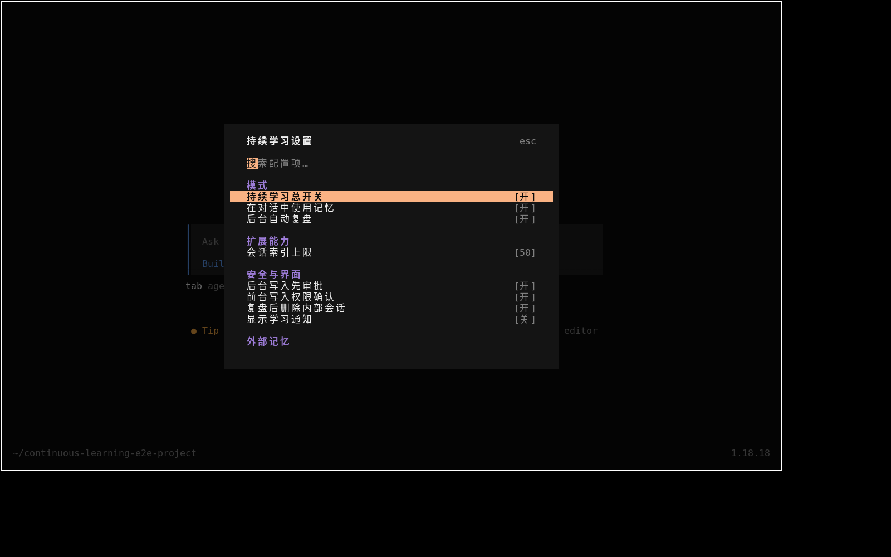
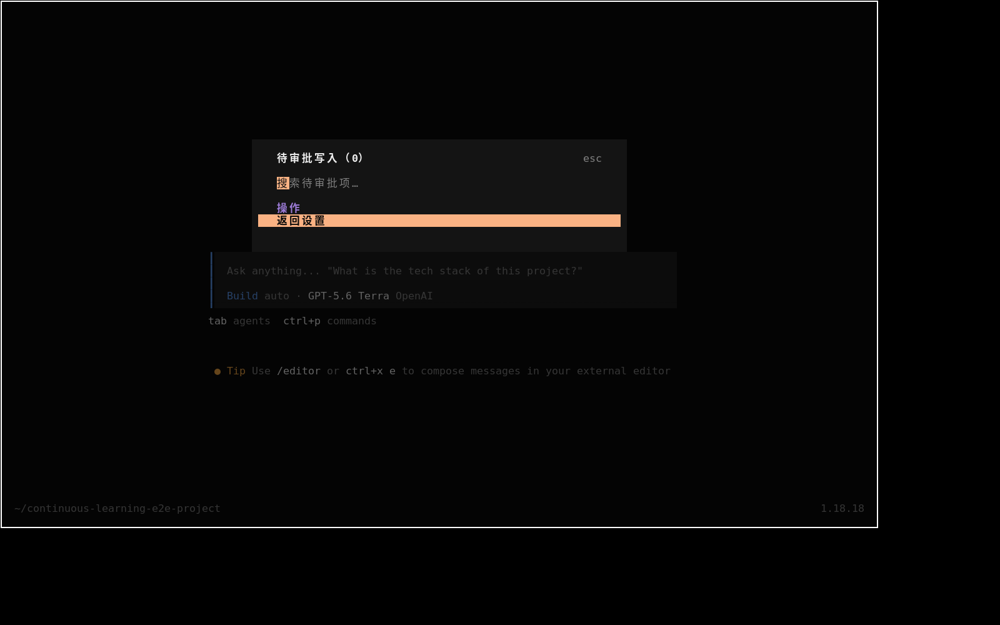

# Continuous Learning 真实端到端测试报告

测试时间：2026-08-13（Asia/Shanghai）
测试对象：`opencode-continuous-learning` 0.5.0
OpenCode：1.18.18
真实模型：`openai/gpt-5.6-terra`

## 结论

本次不是 Mock 测试。测试实际安装了当前插件，创建隔离项目，启动了 OpenCode CLI、常驻 OpenCode Server 和真实 TUI，并让真实模型调用持续学习工具。Memory、Skill、跨会话全文检索、Journey 数据层、Skill 归档删除、自动复盘、后台待审批及批准落盘均已跑通。源代码测试为 21/21 通过，TypeScript 类型检查通过。

同时发现 3 个需要修复的集成缺陷：TUI 的 Pending/Journey 数据目录错误；写锁没有陈旧锁回收；一次性 `opencode run` 退出时不会等待 fire-and-forget 自动复盘，可能留下陈旧写锁。外部 Mem0/Honcho 没有可用凭据，因此没有声称真实外部服务调用通过，只验证了 builtin 路径和 Mem0 adapter 自动测试。

## 测试方法

隔离项目位于 `/home/zzh/continuous-learning-e2e-project`，统一测试标记为 `CL_E2E_20260813`。真实用户行为包括：在 CLI 中给模型自然语言指令，让模型自己生成结构化 tool call；使用 `opencode serve` 和 `opencode run --attach` 触发常驻后台复盘；在 Xvfb 中运行真实 OpenCode TUI，通过键盘输入 `/learning-settings`、`/learning-pending` 和 `/learning-journey`；实际切换“显示学习通知”并核对磁盘配置。

## 用例结果

| 用例 | 真实操作 | 结果 |
|---|---|---|
| 插件安装 | 执行 `scripts/install.sh`，注册服务端入口和 TUI | 通过 |
| 模型连通性 | OpenAI Terra 被要求只回复 `CL_E2E_MODEL_OK` | 通过 |
| 状态与路径 | 模型调用 `learning_status` | 通过，返回 20 项配置和全部数据路径 |
| 项目 Memory | `add → view → 再次 add` | 通过，真实落盘且重复写返回 `changed:false` |
| Skill | `create → view → 重复 create` | 通过，创建成功、provenance 正确、重复创建被保护 |
| 历史全文检索 | `session_search(query=CL_E2E_20260813, limit=5)` | 通过，返回 5 个真实历史会话及 bookend/message 窗口 |
| Journey 时间线 | `learning_journey timeline` | 通过，找到 Memory add 和 Skill create 两条事件 |
| Journey 图谱 | `learning_journey graph` | 通过，Memory 与测试 Skill 形成权重 3 的关联边 |
| Skill 删除 | `view → delete → list` | 通过，移动到 `.continuous-learning-archive`，列表中消失 |
| 自动复盘 | 常驻 Server 中完成一轮普通对话并等待 `session.idle` | 通过，创建隐藏 reviewer 子会话并进行第二次真实模型调用 |
| 后台审批 | reviewer 尝试更新项目 Memory | 通过，生成待审批 ID `e58107113dbc`，没有直接写入 |
| 批准落盘 | `learning_pending list → view → approve` | 通过，返回 `approved:true`、`changed:true`，Memory 已替换 |
| TUI 设置 | 打开设置面板并把“显示学习通知”由关切到开 | 通过，界面立即显示 `[开]`，配置文件同步为 `true` |
| TUI Pending | 打开 `/learning-pending` | 失败，磁盘有 1 条但面板显示 0 条 |
| TUI Journey | 打开 `/learning-journey` | 失败，数据层有 5 条但面板显示 0 条 |
| 自动测试 | `bun test tests/*.test.ts` | 通过，21 pass / 0 fail |
| 类型检查 | `bunx tsc --noEmit` | 通过 |
| 外部 Memory Provider | builtin 实际运行；Mem0 adapter 自动测试 | 部分验证，未配置真实 Mem0/Honcho 凭据 |

## 关键真实调用证据

真实 OpenAI 探针的导出记录在 [model-probe-openai.json](evidence/model-probe-openai.json)，其中包含 provider/model、token 计数和 `CL_E2E_MODEL_OK` 回复。前台 Memory/Skill 完整调用记录在 [foreground-pass-session.json](evidence/foreground-pass-session.json)。跨会话检索实际返回 5 个会话的证据在 [session-search-session.json](evidence/session-search-session.json)。Journey 两个 action 的模型调用在 [journey-session.json](evidence/journey-session.json)。Skill 归档删除在 [skill-delete-session.json](evidence/skill-delete-session.json)。

常驻自动复盘的服务日志在 [03-auto-review-server.log](logs/03-auto-review-server.log)，日志显示源会话结束后创建了 `continuous-learning-review` 子会话，并记录：

```text
Automatic learning review completed ... 待审批 e58107113dbc
```

审批工具的 `list → view → approve → Memory view` 完整记录在 [pending-approve-session.json](evidence/pending-approve-session.json)。批准后的项目 Memory 副本在 [project-memory-after-approval.md](evidence/project-memory-after-approval.md)。Journey 持久化副本在 [learning-journey-after.json](evidence/learning-journey-after.json)。

## 界面截图

设置面板可以正常读取配置，所有可见 footer 的左右方括号均闭合：



磁盘存在待审批记录时，Pending 面板错误显示 0 条：



Journey 数据层已有事件时，Journey 面板错误显示 0 条：


模拟用户切换“显示学习通知”后，面板立即刷新为 `[开]`：


## 发现的缺陷

### P1：TUI 与服务端使用了不同的数据根目录

服务端实际数据根是 `~/.local/share/opencode/continuous-learning`，`opencode debug paths` 的 `data` 也指向 `~/.local/share/opencode`。但 TUI 在 `src/tui.ts:474` 和 `src/tui.ts:540` 使用了 `api.state.path.state`，结果读取 `~/.local/state/opencode/continuous-learning`。因此 Pending 和 Journey 的工具/API 正常，两个界面却始终看不到服务端数据。

建议让 TUI 使用 OpenCode 的 data path；若当前 TUI API 不暴露 data path，应在安装注册时显式传入与服务端一致的 `dataRoot`，并增加“磁盘有 1 条、TUI 必须显示 1 条”的安装后集成测试。

### P1：陈旧 `.write.lock` 不会被回收

测试开始前发现一个 2026-08-11 遗留锁，owner PID 已不存在。`src/core.ts:495` 的 `withStorageLock` 遇到现有锁只重试并最终报 `Persistent learning storage is busy`，没有根据 owner PID、创建时间或租约判断陈旧锁。真实模型因此多次写 Memory 失败，证据在 [foreground-failed-session.json](evidence/foreground-failed-session.json)。旧锁内容保存在 [stale-write.lock](evidence/stale-write.lock)。

建议锁文件保存 PID、主机、创建时间和随机 owner；遇到 `EEXIST` 时读取并验证 PID/租约，确认陈旧后以“重新读取 owner 后再删除”的方式安全回收。

### P1：一次性 CLI 不等待后台自动复盘完成

`src/plugin.ts:1128` 在 `session.idle` 中使用 `void maybeAutoReview(sessionID)`。对于常驻服务这是合理的，但一次性 `opencode run` 会在主回答完成后退出，后台 reviewer 可能正持有写锁。测试中确实生成了第二个、owner PID 已退出的陈旧锁，内容保存在 [stale-write-lock-after-run](evidence/stale-write-lock-after-run)。改用常驻 `opencode serve` 后，同一个自动复盘用例稳定完成。

建议让插件在 host shutdown/dispose 阶段等待 `reviewsInFlight`，或让 OpenCode 的一次性 run 生命周期等待 idle hook 派生任务；至少应配合陈旧锁回收，避免一次中断永久阻塞后续写入。

## 非插件故障

`github-copilot/gpt-5.4-mini` 返回 403 `not licensed to use Copilot`，记录在 [model-probe-copilot.json](evidence/model-probe-copilot.json)。一次 `opencode-go/gpt-5.6-terra` 调用返回上游 `Unexpected server error`，记录在 [01-foreground.jsonl](logs/01-foreground.jsonl)。这些属于本机 provider 许可或上游服务状态，不计为插件失败。后续正式 E2E 全部改用已验证可用的 `openai/gpt-5.6-terra`。

## 自动测试日志

[04-bun-test.log](logs/04-bun-test.log) 显示 21 个测试全部通过；[05-typecheck.log](logs/05-typecheck.log) 为空表示 TypeScript 编译器无诊断并以 0 退出。自动测试覆盖了 Session Search、Pending、Journey/Graph、Skill 可恢复删除、Mem0 adapter、插件后台审批和 TUI 配置编辑，但本报告中的真实模型与 TUI 测试仍是必要的，因为 TUI 数据根错误和 CLI 生命周期问题都没有被单元测试捕获。

## 清理与环境恢复

测试结束后已删除 11 个 `CL_E2E_20260813` OpenCode 会话、隔离测试项目、测试项目 Memory、测试 Skill 归档、Pending/History 和测试 Journey 文件。Session Search 数据库中已无测试会话。用户原配置和 `review-state.json` 均与测试前备份逐字节一致；现有全局 Memory、USER、其他项目 Memory 和 3 个既有 Skill 未被删除或覆盖。

两个失效的陈旧锁没有恢复到运行目录，而是移动到本报告的 evidence 目录，以免再次阻塞真实使用。当前运行目录不存在 `.write.lock`。安装后的插件仍保留为本次测试的 0.5.0 版本。
