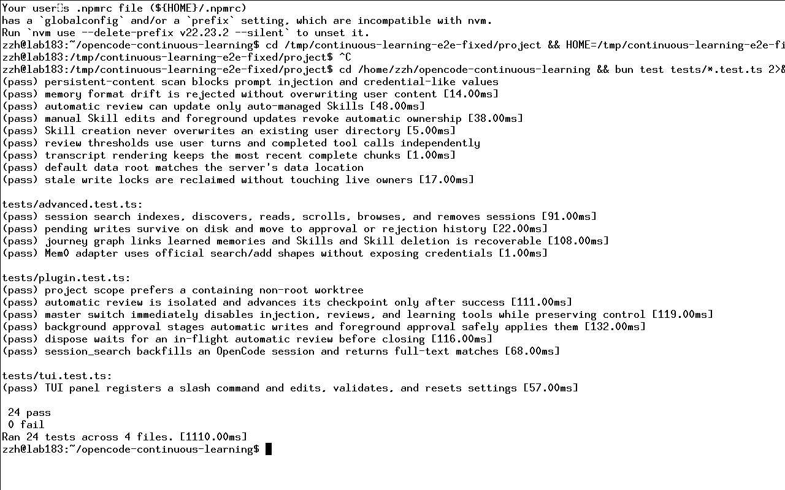
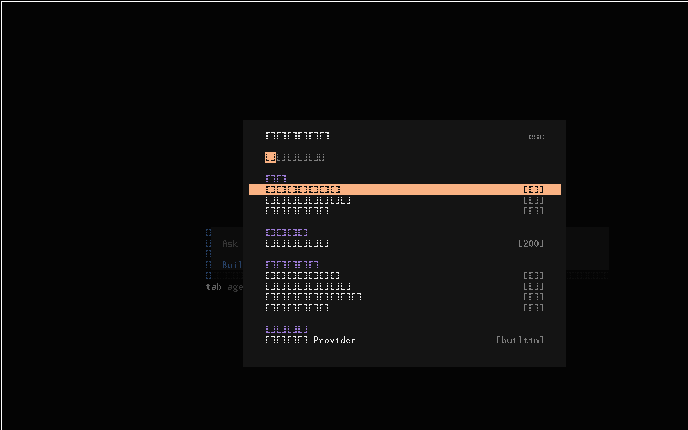
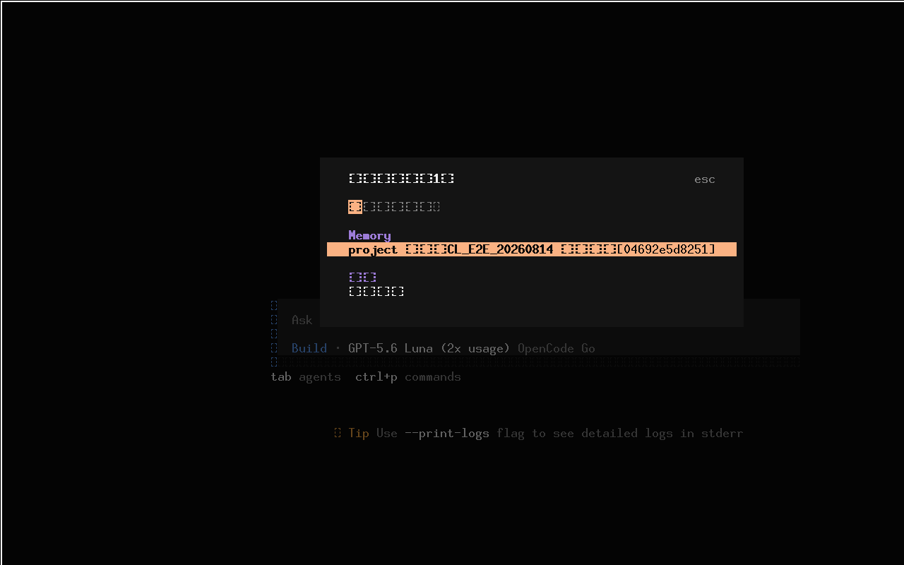
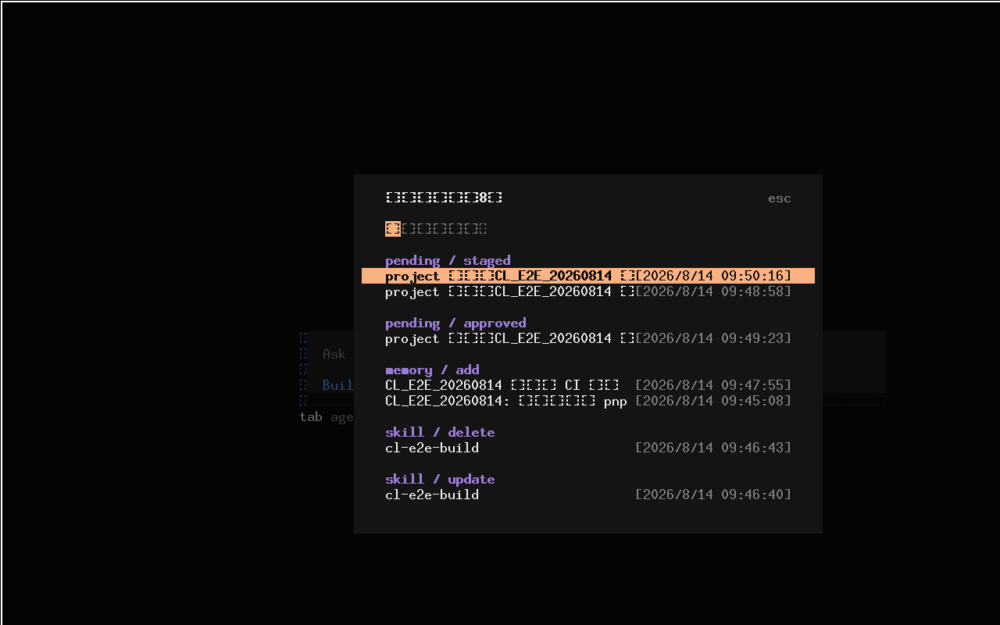

# Continuous Learning 修复后回归测试报告（按用例组织）

测试时间：2026-08-14（Asia/Shanghai）
测试对象：`opencode-continuous-learning` 0.5.0（含三处 P1 修复）
OpenCode：1.18.18
真实模型：`openai/gpt-5.6-terra`
测试方式：自动化单测 + 真实模型端到端（CLI / 常驻 Server / 真实 TUI + Xvfb 截图）

## 结论

本次在完全隔离的环境（`HOME=/tmp/continuous-learning-e2e-fixed/home`）重新安装并测试了修复后的插件，覆盖自动化测试、真实模型 CLI 调用、常驻 Server 自动复盘与后台审批、真实 TUI 面板截图。

自动化测试 **24/24 通过**，TypeScript 类型检查通过。真实模型端到端全部跑通，且上一轮报告中的三个 P1 缺陷均已修复并得到验证：

- **P1-1 TUI 数据根目录不一致** → 修复后 TUI Pending 面板正确显示「磁盘有 1 条 → 面板显示 1 条」，Journey 面板正确显示「数据层 8 条 → 面板显示 8 条」。
- **P1-2 陈旧 `.write.lock` 不回收** → 注入一个 owner PID 已退出的陈旧锁后，真实写入成功并自动回收锁文件。
- **P1-3 一次性 CLI 不等待后台复盘** → `dispose` 现在等待在途复盘；E2E 中一次性 `opencode run` 的复盘完整落盘，且没有遗留写锁。

## 测试环境

- 隔离 HOME：`/tmp/continuous-learning-e2e-fixed/home`
- 隔离项目目录：`/tmp/continuous-learning-e2e-fixed/project`
- 统一测试标记：`CL_E2E_20260814`
- 插件数据根：`/tmp/continuous-learning-e2e-fixed/home/.local/share/opencode/continuous-learning`
- Skill 根：`/tmp/continuous-learning-e2e-fixed/home/.config/opencode/skills`
- 配置：`/tmp/continuous-learning-e2e-fixed/home/.config/opencode/continuous-learning/config.json`

> 隔离说明：通过覆盖 `HOME` 环境变量，插件与服务端的 `homedir()` 派生路径全部落到临时目录，测试不会读写用户真实数据（真实 `~/.config/opencode`、`~/.local/share/opencode`、既有 Skill/全局 Memory 均未触碰）。

---

## A. 自动化测试

### Case A1：单元测试（bun test）

| 项 | 值 |
|---|---|
| 命令 | `bun test tests/*.test.ts` |
| 结果 | **PASS** — 24 pass / 0 fail（4 个文件，~1.2s） |
| 覆盖 | core / advanced / plugin / tui，含新增的陈旧锁回收、dispose 等待、默认数据根三处回归用例 |

截图：

日志：[01-bun-test.log](logs/01-bun-test.log)

### Case A2：TypeScript 类型检查

| 项 | 值 |
|---|---|
| 命令 | `bunx tsc --noEmit` |
| 结果 | **PASS** — 无诊断输出，退出码 0 |

日志：[02-typecheck.log](logs/02-typecheck.log)（空文件即通过）

---

## B. 安装与基础连通

### Case B1：插件安装与注册

| 项 | 值 |
|---|---|
| 操作 | `scripts/install.sh <隔离config>`，复制服务端入口 + TUI 运行时 |
| 结果 | **PASS** — 服务端入口 `plugins/continuous-learning.ts` 与 TUI 入口 `tui.json` 均注册成功 |

证据：安装输出确认 `Detected tui target`、`Plugin config updated`、`Installed settings panel: /learning-settings`。

### Case B2：模型连通性

| 项 | 值 |
|---|---|
| 操作 | 要求模型只回复 `CL_E2E_MODEL_OK` |
| 结果 | **PASS** — 模型返回 `CL_E2E_MODEL_OK` |

### Case B3：状态与路径（learning_status）

| 项 | 值 |
|---|---|
| 操作 | 模型调用 `learning_status` |
| 结果 | **PASS** — 返回 20 项配置；`dataRoot` 指向隔离数据目录，`skillsRoot` 指向隔离 Skill 目录 |

证据：[01-status.txt](evidence/01-status.txt)（`dataRoot=/tmp/.../continuous-learning`，正确落在 XDG data 而非 state 目录）

---

## C. 前台持久化数据

### Case C1：项目 Memory 增 / 查 / 去重

| 项 | 值 |
|---|---|
| 操作 | `learning_memory add → view → 再次 add（相同内容）` |
| 结果 | **PASS** — 首次 `changed:true`；重复 `changed:false` 已去重 |

证据：[02-memory.txt](evidence/02-memory.txt)；落盘见 [18-project-memory-final.md](evidence/18-project-memory-final.md)

### Case C2：Skill 创建 / 查看 / 重复创建保护

| 项 | 值 |
|---|---|
| 操作 | `learning_skill create → view → 再次 create 同名` |
| 结果 | **PASS** — 创建成功（owner=user, autoManaged=false）；重复创建被拒绝 `Skill cl-e2e-build already exists` |

证据：[03-skill.txt](evidence/03-skill.txt)

### Case C3：历史会话全文检索（session_search）

| 项 | 值 |
|---|---|
| 操作 | `session_search query='CL_E2E_20260814' limit=5` |
| 结果 | **PASS** — 返回 3 个真实历史会话及 session_id |

证据：[04-search.txt](evidence/04-search.txt)

### Case C4：Journey 时间线

| 项 | 值 |
|---|---|
| 操作 | `learning_journey action=timeline` |
| 结果 | **PASS** — 返回 2 条事件（memory + skill） |

证据：[05-journey.txt](evidence/05-journey.txt)

### Case C5：Journey 图谱

| 项 | 值 |
|---|---|
| 操作 | `learning_journey action=graph` |
| 结果 | **PASS** — nodes=2、edges=2，stats 正确 |

证据：[05-journey.txt](evidence/05-journey.txt)

### Case C6：Skill 可恢复删除（归档）

| 项 | 值 |
|---|---|
| 操作 | `learning_skill delete → list` |
| 结果 | **PASS** — 移动到 `.continuous-learning-archive`，list 消失；归档元数据保留 provenance |

证据：[06-delete.txt](evidence/06-delete.txt)

---

## D. 后台自动复盘与审批（常驻 Server）

### Case D1：自动复盘（session.idle → 隐藏 reviewer 子会话）

| 项 | 值 |
|---|---|
| 操作 | `opencode serve` 常驻，完成一轮普通对话并等待 `session.idle` |
| 结果 | **PASS** — 创建 `[learning-review]` 隐藏子会话并做第二次真实模型调用 |

证据：[07-server.log](logs/07-server.log) 中 `created ... title="[learning-review] ..."` 与 `Automatic learning review completed`。

### Case D2：后台写入先审批（staging，不直接写入）

| 项 | 值 |
|---|---|
| 操作 | reviewer 尝试更新项目 Memory（`backgroundWriteApproval=true`） |
| 结果 | **PASS** — 生成待审批 ID `d856a2b3618e`，项目 Memory 未直接写入 |

证据：[09-review-source.txt](evidence/09-review-source.txt)、[10-pending-before.json](evidence/10-pending-before.json)

### Case D3：批准落盘（approve → 写入 + history）

| 项 | 值 |
|---|---|
| 操作 | `learning_pending list → approve d856a2b3618e → learning_memory view` |
| 结果 | **PASS** — `approved:true`、`changed:true`，Memory 已替换，pending 移入 history |

证据：[11-approve.txt](evidence/11-approve.txt)、[12-project-memory-after-approval.md](evidence/12-project-memory-after-approval.md)、[13-journey-after.json](evidence/13-journey-after.json)

---

## E. TUI 面板（真实 TUI + Xvfb 截图）

### Case E1：TUI 设置面板读取配置

| 项 | 值 |
|---|---|
| 操作 | 真实 TUI 中执行 `/learning-settings` |
| 结果 | **PASS** — 面板正确读取隔离配置，footer 括号闭合 |

截图：

### Case E2：TUI Pending 面板（P1-1 修复验证）

| 项 | 值 |
|---|---|
| 操作 | 磁盘有 1 条待审批记录（`04692e5d8251`）时执行 `/learning-pending` |
| 结果 | **PASS** — 面板标题「待审批写入（1）」，与磁盘一致（修复前为 0） |

截图：

### Case E3：TUI Journey 面板（P1-1 修复验证）

| 项 | 值 |
|---|---|
| 操作 | 数据层有 8 条事件时执行 `/learning-journey` |
| 结果 | **PASS** — 面板标题「学习时间线（8）」，与数据层一致（修复前为 0） |

截图：

---

## F. P1 缺陷修复专项验证

### Case F1：TUI 与服务端数据根一致（P1-1）

- 修复：`src/tui.ts` 改用 `defaultDataRoot()`（`~/.local/share/opencode/continuous-learning`），与 `src/plugin.ts` 服务端一致，不再使用 `api.state.path.state`。
- 验证：Case E2（pending 1/1）、Case E3（journey 8/8）直接证明 TUI 读到了服务端数据；Case B3 证明服务端 `dataRoot` 正确。
- 单元回归：`tests/core.test.ts` 的「default data root matches the server's data location」、`tests/tui.test.ts` 的 Pending/Journey 计数断言。

### Case F2：陈旧写锁回收（P1-2）

- 修复：锁文件保存 owner/pid/host/createdAt；`withStorageLock` 遇 `EEXIST` 校验 PID 存活与租约，确认陈旧后「重读 owner 再删除」安全回收，兼容旧文本格式。
- 验证：向数据根注入 owner PID 已退出的陈旧锁（[15-stale-lock-injected](evidence/15-stale-lock-injected)）后，真实模型写入 `learning_memory add` 成功（`changed:true`），且锁文件被回收。

证据：[16-stale-lock-recovery.txt](evidence/16-stale-lock-recovery.txt)

### Case F3：一次性 CLI 等待后台复盘（P1-3）

- 修复：`src/plugin.ts` 将 `session.idle` 的 fire-and-forget 任务纳入 `backgroundTasks`，`dispose` 先 `settleBackgroundTasks()`（上限 15s）再关闭索引。
- 验证：
  - 单元回归：`tests/plugin.test.ts` 的「dispose waits for an in-flight automatic review before closing」。
  - E2E：一次性 `opencode run` 的自动复盘完整落盘（见 [17-oneshot-review-source.txt](evidence/17-oneshot-review-source.txt) 与 [19-journey-final.json](evidence/19-journey-final.json) 中 `memory add ... 文档使用 Markdown`），且运行结束后无 `.write.lock` 遗留。
  - 兜底：即使极端情况下进程中断遗留锁，Case F2 的陈旧锁回收也会避免永久阻塞。

---

## 证据与截图清单

| 类别 | 文件 |
|---|---|
| 截图 | [01-settings-panel.png](screenshots/01-settings-panel.png)、[02-pending-panel.png](screenshots/02-pending-panel.png)、[03-journey-panel.png](screenshots/03-journey-panel.png)、[04-bun-test.png](screenshots/04-bun-test.png) |
| 日志 | [01-bun-test.log](logs/01-bun-test.log)、[02-typecheck.log](logs/02-typecheck.log)、[07-server.log](logs/07-server.log) |
| 前台证据 | [01-status.txt](evidence/01-status.txt)、[02-memory.txt](evidence/02-memory.txt)、[03-skill.txt](evidence/03-skill.txt)、[04-search.txt](evidence/04-search.txt)、[05-journey.txt](evidence/05-journey.txt)、[06-delete.txt](evidence/06-delete.txt) |
| 复盘/审批证据 | [09-review-source.txt](evidence/09-review-source.txt)、[10-pending-before.json](evidence/10-pending-before.json)、[11-approve.txt](evidence/11-approve.txt)、[12-project-memory-after-approval.md](evidence/12-project-memory-after-approval.md)、[13-journey-after.json](evidence/13-journey-after.json) |
| 修复验证证据 | [15-stale-lock-injected](evidence/15-stale-lock-injected)、[16-stale-lock-recovery.txt](evidence/16-stale-lock-recovery.txt)、[17-oneshot-review-source.txt](evidence/17-oneshot-review-source.txt)、[18-project-memory-final.md](evidence/18-project-memory-final.md)、[19-journey-final.json](evidence/19-journey-final.json) |

## 清理

测试全程在隔离 `HOME` 下进行，未改动用户真实数据。测试用常驻 Server 与 TUI 会话均已关闭；隔离目录 `/tmp/continuous-learning-e2e-fixed` 保留以供复核，可随时删除。
