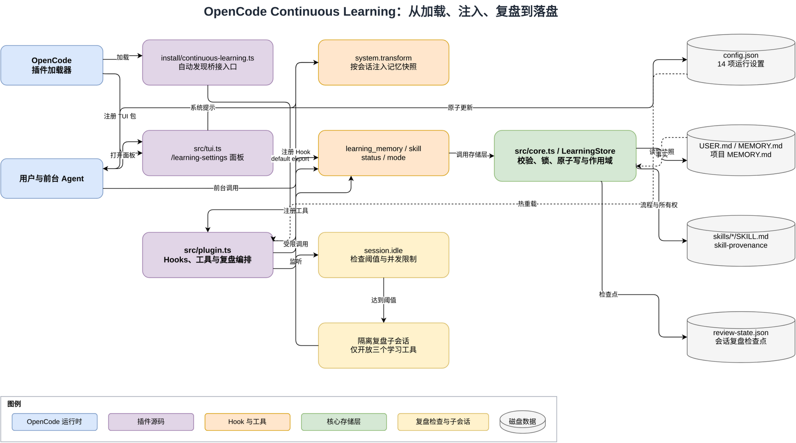

# OpenCode Continuous Learning：项目结构与调用关系保姆级教程

请先阅读第一章的基础词汇，再进入项目内容。这份教程不按代码行号讲，而是先建立整体认识，再说明各部分怎样互相配合。读完以后，你应该能找到程序开始运行的位置，分清不同代码块的身份，并能顺着一个功能一直找到最终保存数据的位置。

这套插件没有训练模型，也没有修改模型参数。它所说的“持续学习”，只是把稳定事实和可复用做法保存成本地文件，后续对话再把它们读回来。



可编辑的图源在 [`docs/images/continuous-learning-call-flow.drawio`](images/continuous-learning-call-flow.drawio)。第一次阅读只需要顺着图从左向右看：OpenCode 加载入口，入口创建插件运行环境，插件调用核心存储层，核心存储层读写右侧文件。

## 第一章：先把后面会出现的词讲明白

“项目”是为一个完整目标共同工作的全部文件。本项目就是整个 `opencode-continuous-learning/` 目录。

“插件”是被主程序加载、用来增加功能的一组代码。OpenCode 是主程序，Continuous Learning 是插件。“运行时”是程序已经被加载并实际执行的阶段，与只放在磁盘上但尚未执行的源代码相对。

“模型”是生成回答的人工智能模型。“Agent”是围绕模型增加提示、工具和执行规则后形成的工作角色。“提示”是交给模型的文字指令；“系统提示”是平台在普通用户消息之外提供的高优先级背景说明。本插件把已有知识加入系统提示，使它能影响后续回答。

“源代码”是程序员写下、供计算机解释或编译的程序文本。“TypeScript”是一种源代码语言，它在 JavaScript 的基础上增加了类型检查。本项目的主要源文件都以 `.ts` 结尾。

“Markdown”是一种用少量符号表示标题、段落和列表的纯文本格式，文件通常以 `.md` 结尾。“JSON”是一种用键和值保存结构化数据的纯文本格式。本项目用 Markdown 保存可读知识，用 JSON 保存配置和内部状态。

“Memory”在本项目中是由一条条稳定事实组成的 Markdown 文件。“Skill”在本项目中是一个标准 `SKILL.md`，用于保存可重复执行的方法。它们都是外部知识文件，不是模型内部参数。

“目录”是文件夹。“模块”是承担一组明确职责的代码文件。例如 [`src/core.ts`](../src/core.ts) 是核心存储模块，[`src/plugin.ts`](../src/plugin.ts) 是运行编排模块。一个目录可以包含多个模块。

“分层”是把不同职责放到不同区域。可以把它想成餐厅：前台接单、后厨编排、仓库保管原料。前台不应该直接跑进仓库改库存，仓库也不负责接待顾客。本项目同样把 OpenCode 接口、业务编排、数据存储和界面分开。

“类型”是 TypeScript 对数据形状的说明。例如 `LearningConfig` 规定配置必须包含哪些字段。类型主要在写代码和检查代码时生效，程序运行后不会自动替你校验外部 JSON。

“类”是制造同类对象的蓝图。类只描述“这种东西拥有哪些数据和能力”。本项目最重要、也是唯一承担核心业务的类是 `LearningStore`。

“对象”是根据类或对象字面量真正创建出来、运行时存在的一份数据。`new LearningStore(...)` 创建出来的 `store` 是对象；`{ enabled: true }` 也是对象，后者不需要类，叫“对象字面量”。

“Map”是按键查找值的内置对象，例如用会话 ID 查找快照。“Set”是只保存不重复成员的内置对象，例如记录哪些会话正在复盘。

“属性”是对象保存的数据。例如 `store.memoryPath` 是 `store` 对象的一个属性，表示全局 Memory 文件路径。

“方法”是挂在对象或类实例上的函数。例如 `store.readMemory("user")` 中，`readMemory` 是 `store` 对象的方法。

“函数”是一段可以被调用的代码。如果它独立存在，例如 `normalizeConfig(value)`，通常称为函数；如果它属于某个对象，例如 `store.addMemory(...)`，通常称为方法。二者本质都接收输入、执行逻辑、返回结果。

“箭头函数”是 TypeScript 编写函数的一种形式，例如 `(value) => value + 1`。“异步函数”是在函数前写 `async` 的函数，它返回一个代表将来结果的 `Promise` 对象；`await` 表示在当前异步函数中等待这个结果完成。本项目读文件和调用 OpenCode 时大量使用异步函数。

“回调函数”是先交给另一个系统、等特定事情发生后再由对方调用的函数。Hook、工具的 `execute` 和 TUI 的 `onSelect` 都属于回调函数。

“参数”是调用函数时交进去的数据。“返回值”是函数执行后交回来的数据。`store.readMemory("project")` 中，`"project"` 是参数，最后得到的字符串数组是返回值。

“实例”是由类创建的对象，所以 `store` 也可以叫 `LearningStore` 的实例。本文会优先说“store 对象”，避免第一次阅读时被术语绊住。

“入口”是外部系统开始执行本项目代码的位置。这个项目不是只有一个入口：安装时有脚本入口，OpenCode 服务端有插件入口，设置面板还有独立的 TUI 入口。

“导入”是用 `import` 取得其他模块公开的内容。“导出”是用 `export` 把当前模块的内容交给其他模块使用。“默认导出”是一个模块最主要的导出，写作 `export default`；OpenCode 正是通过默认导出取得本项目的插件函数。

“SDK”是外部平台提供给插件使用的一组代码接口。这里的 `@opencode-ai/plugin` 是 OpenCode SDK。插件通过它读取会话、创建子会话、注册工具和显示通知，不需要自己实现 OpenCode。

“Hook”中文常叫钩子，意思是“平台在某个时机回调你的函数”。例如 OpenCode 准备系统提示时会调用系统提示 Hook；会话空闲时会调用事件 Hook。代码不是一直循环检查，而是等 OpenCode 通知。

“事件”是运行过程中发生的一件事，例如 `session.idle` 表示会话进入空闲状态，`session.deleted` 表示会话被删除。

“会话”是用户与 Agent 的一段连续对话。“子会话”是挂在原会话下面的内部会话。本项目使用子会话做后台复盘，避免复盘提示和回答混入用户原对话。

“TUI”是 Terminal User Interface，也就是终端里的图形化界面。它仍运行在终端中，但可以显示列表、输入框、确认框和提示消息。本项目的 `/learning-settings` 就是 TUI 面板。

“持久化”是把运行内存中的数据写到磁盘，使程序退出后数据仍然存在。Memory、用户画像、Skill 和复盘检查点都是持久化数据。

“快照”是某一时刻数据的固定副本。本项目把已有 Memory 和 Skill 索引组成系统提示快照；同一会话中默认复用这份快照，不会每轮突然变化。

“检查点”是记录处理进度的数据。复盘检查点保存某个会话上次成功复盘时已经统计了多少用户回合、多少工具调用，从而避免反复处理旧内容。

“原子写入”是让读者只能看到完整旧文件或完整新文件，不会看到只写了一半的文件。本项目先写临时文件，再用重命名替换正式文件。

“锁”是多个写入者之间的排队机制。本项目用锁文件保证两个 OpenCode 进程不会同时改 Memory 或 Skill 而互相覆盖。

“哈希”是根据文件内容计算出的固定长度指纹。内容只要变化，指纹通常就会变化。本项目用 SHA-256 哈希判断自动生成的 Skill 是否被用户手工修改过。

“来源记录”在代码中叫 provenance，表示一份内容是谁创建的、是否允许自动管理、当前内容指纹是什么。本项目把 Skill 的来源记录单独保存在 JSON 文件里。

现在这些词已经解释过，后文会直接使用。

### 看见一段 TypeScript 时，怎样判断它是什么

下面这张表是阅读本项目最实用的识别方法：

| 代码外形 | 它是什么 | 本项目中的例子 |
|---|---|---|
| `interface Name { ... }` | 类型说明，不会创建运行时对象 | `interface LearningConfig` |
| `type Name = ...` | 类型别名，也不会创建运行时对象 | `type PanelAction = ...` |
| `class Name { ... }` | 类的蓝图 | `class LearningStore` |
| `new Name(...)` | 根据类创建对象 | `new LearningStore(...)` |
| `const value = { ... }` | 普通对象 | `DEFAULT_CONFIG`、TUI 默认导出对象 |
| `function name(...) { ... }` | 独立函数 | `normalizeConfig(...)` |
| `const name = (...) => { ... }` | 用箭头形式写的函数 | `refreshConfig`、`maybeAutoReview` |
| 类里面的 `name(...) { ... }` | 实例方法 | `LearningStore.readMemory(...)` |
| 对象里面的 `name(...) { ... }` | 对象的方法属性 | 工具对象的 `execute(...)` |
| `object.name(...)` | 调用对象的方法 | `store.addMemory(...)` |
| `name(...)` | 调用独立函数 | `countTranscript(...)` |
| `return { ... }` | 返回一个新对象 | 插件入口返回 Hooks 对象 |

`interface` 和 `type` 最容易被初学者误认为对象。它们只是给 TypeScript 检查代码用的说明书；只有程序实际执行 `{ ... }`、`new ...` 或某个返回对象的函数时，运行内存中才会出现对象。

## 第二章：先看项目分层，不要急着钻进函数

从职责看，项目可以分成六层。上层接收请求，下层提供能力；调用通常从上往下发生。

```text
第 1 层：安装与发现
scripts/install.sh、scripts/install.ps1（安装时生成 plugins/continuous-learning.ts 入口）
         ↓
第 2 层：OpenCode 运行编排
src/plugin.ts
         ↓
第 3 层：核心业务与高级能力
src/core.ts 中的 LearningStore 和配置/复盘函数
src/advanced.ts 中的会话索引、审批、Journey 和外部 Provider
         ↓
第 4 层：磁盘数据
MEMORY.md、USER.md、项目 MEMORY.md、SKILL.md、SQLite 索引、JSON 状态

旁路 A：src/tui.ts 负责设置面板，通过配置函数写 config.json
旁路 B：commands/*.md 负责给前台 Agent 提供命令提示词
旁路 C：tests/*.test.ts 验证以上行为，不参加正式运行
```

### 第 1 层：安装与发现

[`scripts/install.sh`](../scripts/install.sh) 和 [`scripts/install.ps1`](../scripts/install.ps1) 是安装程序。它们负责复制文件、生成插件入口和 `package.json`、备份旧版本、安装命令和注册 TUI。它们不判断复盘阈值，也不读写 Memory，所以不属于核心学习逻辑。

安装脚本会在 `plugins/` 目录下自动生成 `continuous-learning.ts` 入口文件。安装后它位于 OpenCode 自动扫描的 `plugins/` 目录。它只做一件事：导入 `src/plugin.ts` 的默认导出，再原样导出给 OpenCode。

```ts
import plugin from "../continuous-learning-plugin/src/plugin.ts";
export default plugin;
```

这里 `plugin` 是一个函数值，不是对象，也不是类。OpenCode 发现这个默认导出后会调用它。

### 第 2 层：运行编排

[`src/plugin.ts`](../src/plugin.ts) 像餐厅的调度员。它知道 OpenCode 当前发生了什么，决定何时读记忆、何时复盘、后台 Agent 能用哪些工具，但它不亲自实现所有文件格式和锁。

这个模块主要包含三类代码：独立辅助函数、插件入口函数、入口函数返回的 Hooks 与工具对象。

### 第 3 层：核心业务与存储

[`src/core.ts`](../src/core.ts) 像仓库管理员。它不知道 TUI 面板长什么样，也不负责创建 OpenCode 子会话；它只关心配置是否合法、Memory 怎样解析、Skill 怎样保存、并发写入怎样保护。

这一层包含一个核心类 `LearningStore`，以及一组不依赖类实例的独立函数。

[`src/advanced.ts`](../src/advanced.ts) 是扩展存储层。`SessionSearchStore` 管理 SQLite FTS5 会话索引，`PendingWriteStore` 管理待审批操作，`LearningJourneyStore` 管理学习时间线和关系图，`ExternalMemoryAdapter` 对接 Mem0 与 Honcho。它们仍由 `plugin.ts` 编排，不会自己响应 OpenCode 事件。

### 第 4 层：磁盘数据

正式数据默认分为以下几类：

| 数据 | 默认位置 | 作用域 |
|---|---|---|
| 全局 Memory | `~/.local/share/opencode/continuous-learning/MEMORY.md` | 当前用户的所有项目 |
| 用户画像 | `~/.local/share/opencode/continuous-learning/USER.md` | 当前用户的所有项目 |
| 项目 Memory | `.../projects/<项目名-路径哈希>/MEMORY.md` | 只有对应项目 |
| Skills | `~/.config/opencode/skills/<name>/SKILL.md` | OpenCode 全局 Skill 目录 |
| Skill 来源记录 | `.../skill-provenance/<name>.json` | 插件内部管理 |
| Skill 可恢复归档 | `~/.config/opencode/skills/.continuous-learning-archive/` | 已归档的 Skill |
| 复盘检查点 | `.../review-state.json` | 按会话 ID 保存 |
| 会话全文索引 | `.../session-search.sqlite` | 已索引项目逐步汇集的全局索引 |
| 学习 Journey | `.../learning-journey.json` | Memory、Skill、审批和 Provider 事件 |
| 待审批写入 | `.../pending/*.json` | 后台尚未执行的操作 |
| 运行配置 | `~/.config/opencode/continuous-learning/config.json` | 插件全局配置 |

“全局”在这里是当前操作系统用户的 OpenCode 全局数据，不代表上传到网络，也不代表所有电脑共享。

### 旁路 A：设置面板

[`src/tui.ts`](../src/tui.ts) 是独立的界面控制器。它读取配置、生成选项、响应用户选择，再调用配置和高级存储函数。除了设置面板，它还提供待审批写入与 Journey 浏览界面；批准操作会重新经过 `LearningStore` 的安全规则。

### 旁路 B：Slash 命令

[`commands/learn.md`](../commands/learn.md) 和 [`commands/learn-review.md`](../commands/learn-review.md) 是给前台 Agent 的提示词模板，不是 TypeScript 程序入口。用户执行 `/learn` 后，OpenCode 把 Markdown 内容交给当前 Agent，Agent 再决定调用 `learning_skill` 等工具。

### 旁路 C：测试

[`tests/core.test.ts`](../tests/core.test.ts)、[`tests/advanced.test.ts`](../tests/advanced.test.ts)、[`tests/plugin.test.ts`](../tests/plugin.test.ts) 和 [`tests/tui.test.ts`](../tests/tui.test.ts) 是验证程序。它们会主动创建对象和调用方法，但只在执行测试时运行。

## 第三章：程序入口到底在哪里

“入口”必须结合运行场景回答，不能只说一个文件。

### 场景一：用户安装插件

Linux 或 macOS 从 `scripts/install.sh` 进入，Windows 从 `scripts/install.ps1` 进入。这是部署入口，不是每次聊天的业务入口。

### 场景二：OpenCode 启动服务端插件

调用顺序是：

```text
OpenCode 插件加载器
  → 安装后的 plugins/continuous-learning.ts
  → src/plugin.ts 的 default export 函数
  → 创建 LearningStore 对象
  → 返回 Hooks 对象
```

真正的业务入口写法是：

```ts
export default (async ({ client, directory, worktree }, rawOptions) => {
  // 初始化
  return {
    config: async (...) => { ... },
    tool: { ... },
    "experimental.chat.system.transform": async (...) => { ... },
    event: async (...) => { ... },
  }
}) satisfies Plugin
```

最外层是一个异步箭头函数。它不是类，也不是对象。OpenCode 调用它后，它才返回一个对象。返回的对象就是 Hooks 对象，里面的 `config`、`chat.message`、`experimental.chat.system.transform`、`event` 和 `dispose` 是回调，`tool` 属性则包含八个工具对象。

插件入口通常只在插件装载时调用一次；后面的每轮对话不会重新创建整个 `LearningStore`，而是调用已经返回的 Hook。

### 场景三：用户打开设置面板

设置面板走另一条入口：

```text
OpenCode TUI 插件加载器
  → 读取安装目录 package.json 的 exports["./tui"]
  → 加载 src/tui.ts 的默认导出对象
  → 取出这个对象的 tui 方法并调用
  → 注册 /learning-settings
```

`src/tui.ts` 最后导出的是对象：

```ts
export default {
  id: "continuous-learning-settings",
  tui,
}
```

这里整个 `{ id, tui }` 是对象；`id` 是属性；`tui` 是一个函数属性。OpenCode 调用 `tui(api, options, meta)` 后，函数向命令面板注册 `/learning-settings`。

### 场景四：开发者运行测试

`package.json` 中的 `npm test` 是测试入口，实际执行 `bun test tests/*.test.ts`。测试会自己导入类和函数，不经过安装桥接文件。

## 第四章：全项目最重要的类——LearningStore

`LearningStore` 的含义是“持续学习数据仓库”。它是一个类，定义在 [`src/core.ts`](../src/core.ts) 中。

### 4.1 类、构造方法和对象的关系

下面是简化后的结构：

```ts
export class LearningStore {
  readonly dataRoot: string
  readonly skillsRoot: string
  readonly config: LearningConfig

  constructor(dataRoot, skillsRoot, config, projectRoot?) {
    // 计算并保存所有路径
  }

  async ensureLayout() { ... }
  async readMemory(target) { ... }
  async addMemory(target, content) { ... }
  // 其他方法
}
```

`class LearningStore { ... }` 整个区块是类。类内部的 `dataRoot`、`skillsRoot`、`config` 等是属性声明。`constructor(...)` 是构造方法：每次执行 `new LearningStore(...)` 时自动调用一次。`ensureLayout()`、`readMemory()`、`addMemory()` 等是实例方法。

在 `plugin.ts` 中真正创建对象的是：

```ts
const store = new LearningStore(dataRoot, skillsRoot, config, projectRoot)
await store.ensureLayout()
```

第一句把类变成一个真实的 `store` 对象。第二句通过点号调用对象的方法。以后所有工具都闭包引用同一个 `store` 对象。

### 4.2 构造方法保存了什么

构造方法接收四个参数：数据根目录、Skill 根目录、配置对象、可选的项目根目录。它先确认重要路径合法且互不重叠，然后计算下列属性：

```text
store.memoryPath          全局 MEMORY.md
store.userPath            USER.md
store.projectMemoryPath   当前项目 MEMORY.md
store.reviewStatePath     review-state.json
store.provenanceRoot      Skill 来源记录目录
```

这些属性标记为 `readonly`，意思是不能把 `store.memoryPath` 重新指向另一条路径。`store.config` 虽然不能换成另一个对象，但配置对象内部字段仍可以被 `Object.assign` 更新，所以设置能够热生效。

### 4.3 方法按职责分成四组

#### 第一组：目录初始化方法

`ensureLayout()` 创建所需目录，并检查它们是真实目录而不是符号链接。调用者只有插件入口和测试。插件必须先等待它成功，才返回 Hooks。

调用方式：

```ts
await store.ensureLayout()
```

#### 第二组：Memory 方法

`readMemory(target)` 读取指定作用域。`target` 只能是 `memory`、`user` 或 `project`。

`addMemory(target, content)` 增加一条内容，并进行危险文本检查、单行化、大小写不敏感去重、加锁和容量检查。

`replaceMemory(target, oldText, content)` 用唯一匹配的旧文本替换一条内容。如果 `oldText` 匹配零条或多条，会拒绝操作，避免改错。

`removeMemory(target, oldText)` 删除唯一匹配的一条内容。

`memoryFile(target)` 和 `writeMemory(target, entries)` 是私有方法。`private` 表示只有 `LearningStore` 类内部能调用，插件不能写 `store.writeMemory(...)`。公共方法先完成业务检查，再在内部调用私有方法落盘。

一条新增调用链是：

```text
learning_memory.execute
  → store.addMemory
  → assertSafePersistentText
  → withStorageLock
  → store.readMemory
  → store.writeMemory（私有）
  → atomicWriteText
  → MEMORY.md / USER.md / 项目 MEMORY.md
```

#### 第三组：Skill 方法

`listSkills()` 扫描 Skill 目录并返回名称、描述、路径和所有权摘要。

`viewSkill(name)` 读取完整 `SKILL.md`。如果来源记录可信，还会更新最后使用时间。

`createSkill(input)` 创建一个全新的 Skill 目录和文件。只要同名目录存在就拒绝，绝不自动接管用户已有内容。

`updateSkill(input)` 更新 Skill。后台 Agent 只能修改来源可信、所有者为 `agent` 且允许自动管理的 Skill；前台用户更新后，所有权会变为用户所有。

`readProvenance(name)` 读取来源记录；`trustedProvenance(name, content)` 进一步比较当前文件哈希。后者是私有方法，因为“什么叫可信”属于仓库内部规则。

Skill 创建调用链是：

```text
learning_skill.execute
  → store.createSkill
  → 检查名称、描述和正文
  → renderSkill 生成标准 SKILL.md
  → withStorageLock
  → createTextExclusive 独占创建文件
  → atomicWriteText 保存来源记录
```

#### 第四组：复盘状态和快照方法

`getReviewState()` 读取整个复盘状态文件。

`getCheckpoint(sessionID)` 读取一个会话的检查点，不存在时返回零计数。

`updateCheckpoint(sessionID, value)` 保存某个会话最新复盘状态。

`deleteCheckpoint(sessionID)` 在会话删除时清理对应记录。

`buildSystemSnapshot()` 并发读取全局 Memory、用户画像、当前项目 Memory 和 Skill 索引，组装成系统提示文字。它不缓存；缓存由上层 `plugin.ts` 管理。

### 4.4 哪些代码不是 LearningStore 的方法

`normalizeConfig()`、`loadConfig()`、`updateConfig()`、`atomicWriteText()`、`countTranscript()`、`isReviewDue()` 和 `renderTranscript()` 都是独立函数。调用时直接写函数名，不写 `store.`：

```ts
const config = await loadConfig(configPath)
const counts = countTranscript(transcript)
const due = isReviewDue(counts, checkpoint, config)
```

把它们做成独立函数，是因为它们不依赖某一个 `LearningStore` 对象的内部状态，输入相同就容易得到相同结果，也更容易单独测试。

## 第五章：plugin.ts 不是一个类，它是“运行时工厂”

“工厂”是负责创建一组可用对象或函数的代码。这里用这个词，是因为插件入口接收 OpenCode 提供的环境，创建 `store`、缓存和多个回调，最后返回 Hooks 对象。

### 5.1 OpenCode 交给入口什么

入口第一个参数包含 `client`、`directory` 和 `worktree`。

`client` 是 OpenCode SDK 客户端对象。插件通过 `client.session.messages(...)` 读会话，通过 `client.session.create(...)` 创建子会话，通过 `client.session.prompt(...)` 让子会话执行复盘。

`directory` 是当前工作目录。`worktree` 是 OpenCode 识别到的工作树根目录。`selectProjectRoot()` 会选择一个安全的项目根，避免把文件系统 `/` 当成一个巨大项目。

第二个参数 `rawOptions` 是用户传给插件的可选设置。路径类选项可以覆盖默认位置；文件配置随后由 `loadConfig()` 读取。

### 5.2 入口创建哪些对象

入口运行时创建的主要对象如下：

| 变量 | 类型/身份 | 用途 |
|---|---|---|
| `options` | 普通对象 | 插件选项 |
| `config` | `LearningConfig` 对象 | 当前运行配置 |
| `store` | `LearningStore` 对象 | 核心存储服务 |
| `systemSnapshots` | `Map` 对象 | 会话 ID 到快照 Promise |
| `automaticSessions` | `Map` 对象 | 后台会话及本轮写权限 |
| `ignoredReviewSessions` | `Set` 对象 | 防止复盘子会话递归复盘 |
| `reviewsInFlight` | `Set` 对象 | 防止同一源会话重复启动复盘 |
| `reviewWrites` | `Map` 对象 | 收集本轮写入摘要 |

`Map` 是键到值的映射对象，`Set` 是不重复成员集合对象。它们只存在于当前 OpenCode 进程内，程序退出就消失；真正需要跨重启保留的数据交给 `LearningStore` 落盘。

### 5.3 入口内部的辅助函数为什么能访问 store

`refreshConfig`、`notify`、`askForForegroundWrite` 和 `maybeAutoReview` 都定义在插件入口函数内部。它们不是 `store` 的方法，也不是 Hooks 对象的方法，而是入口函数的局部函数。

“闭包”是函数记住其定义位置周围变量的能力。因为这些函数定义在入口里面，所以它们可以直接访问 `client`、`config`、`store` 和几个 Map/Set，无需每次把所有对象作为参数传入。

例如：

```ts
const refreshConfig = async () => {
  const next = await loadConfig(configPath)
  Object.assign(config, next)
  systemSnapshots.clear()
}
```

这里 `configPath`、`config` 和 `systemSnapshots` 都来自外层入口，这就是闭包。

### 5.4 Hooks 对象里有哪些入口方法

插件最后返回的对象可以理解为 OpenCode 的“回调菜单”。OpenCode 在不同时间选择不同项调用。

| Hook/属性 | 谁调用 | 何时调用 | 本项目做什么 |
|---|---|---|---|
| `config` | OpenCode | 解析插件配置时 | 注入隐藏复盘 Agent |
| `tool` | OpenCode/Agent | Agent 调用工具时 | 执行 8 类结构化学习操作 |
| `chat.message` | OpenCode | 用户消息进入会话时 | 保存本轮外部记忆召回查询 |
| `experimental.chat.system.transform` | OpenCode | 组装模型系统提示时 | 注入本地快照和可选外部召回 |
| `event` | OpenCode | 会话事件发生时 | 处理压缩、删除、索引、同步和空闲复盘 |
| `dispose` | OpenCode | 卸载插件时 | 关闭 SQLite 连接 |

`tool` 自己不是函数，而是一个对象；它的八个属性分别是 `tool(...)` 工厂创建的工具对象。

## 第六章：八个工具对象怎样协作

“工具”是 Agent 可以按结构化参数调用的能力。每个工具对象包含说明、参数规则和 `execute` 执行方法。

简化结构如下：

```ts
learning_memory: tool({
  description: "...",
  args: { ... },
  async execute(args, context) {
    // 真正执行
  },
})
```

`tool({ ... })` 的参数是对象字面量。对象中的 `description` 和 `args` 是属性，`execute` 是方法简写。`tool(...)` 再返回 OpenCode 能识别的工具对象。

### 6.1 learning_memory

入口是 `learning_memory.execute(args, context)`。`args` 保存模型传入的 action、target、content 等；`context` 保存当前会话 ID 和权限询问方法。

它先调用 `refreshConfig()`，再检查总开关。查看操作调用 `store.readMemory()`；新增、替换、删除先检查本轮权限，再分别调用 `store.addMemory()`、`store.replaceMemory()`、`store.removeMemory()`。

### 6.2 learning_skill

入口是 `learning_skill.execute(args, context)`。列表和查看调用 `store.listSkills()` 与 `store.viewSkill()`；创建、更新和归档删除根据当前会话是否属于后台复盘，决定 `owner/origin` 是 `agent` 还是 `user`。删除不会递归擦除目录，而是调用 `store.deleteSkill()` 移动到可恢复归档；后台删除还要求可信所有权和 `absorbed_into`。

权限并不只靠提示词。即使后台 Agent 请求更新用户 Skill，`LearningStore.updateSkill()` 仍会在存储层拒绝。

### 6.3 learning_status

入口是 `learning_status.execute()`。它是只读工具，并行调用 Memory、Skill 和复盘状态读取方法，再返回一个 JSON 对象。它主要用于检查路径、数量和当前配置。

### 6.4 learning_mode

入口是 `learning_mode.execute(args, context)`。它读写总开关，底层调用 `setConfigEnabled()`。用户界面已经移除了 `/learn-mode` Slash 命令，但内部工具仍保留，用于状态查询和程序化控制；后台复盘不能调用它修改自身模式。

### 6.5 session_search

入口是 `session_search.execute(args)`。它先让 `syncHistoricalSessions()` 补建当前项目可见的旧会话，再调用 `SessionSearchStore` 完成浏览、全文发现、读取和围绕消息滚动。索引落在全局 SQLite 中，因此不同项目实例索引过的会话可以统一检索。

### 6.6 learning_pending

入口是 `learning_pending.execute(args, context)`。后台复盘只能创建 pending，不能批准自己；前台批准时，`applyPendingRecord()` 按记录中的项目根重新建立 `LearningStore`，再执行当前版本的安全、容量和所有权检查。

### 6.7 learning_journey

入口是 `learning_journey.execute(args)`。`timeline` 读取持久事件，`graph` 把现存 Memory 与 Skill 变成节点，再生成词法关联边和时间顺序边。

### 6.8 learning_external_memory

入口是 `learning_external_memory.execute(args)`。`status` 只报告 Provider 配置状态而不返回密钥；`search` 通过 `ExternalMemoryAdapter` 调用 Mem0 或 Honcho。普通会话中的自动召回与回合同步则由 Hook 和事件入口触发。

## 第七章：一次普通对话怎样读取记忆

完整调用顺序是：

```text
OpenCode 准备模型系统提示
  → 调用 experimental.chat.system.transform
  → refreshConfig() 检查面板是否刚改过配置
  → 检查 enabled 和 memoryContextEnabled
  → 从 systemSnapshots 查当前会话快照
  → 没有缓存时调用 store.buildSystemSnapshot()
      → store.readMemory("memory")
      → store.readMemory("user")
      → store.readMemory("project")
      → store.listSkills()
  → 把快照追加到 output.system
  → 模型看到已有知识
```

`systemSnapshots` 保存的是 `Promise<string>`。这样两个同时到来的系统提示请求会等待同一次构建，不会重复读盘。

关闭 `memoryContextEnabled` 只让这条调用链提前返回。Memory 文件不会删除，学习工具和自动复盘也仍可运行。关闭 `enabled` 才会整体停止注入、自动复盘和学习工具读写。

## 第八章：一次自动复盘怎样运行

### 8.1 起点是 session.idle

OpenCode 完成一轮回答后发出 `session.idle` 事件。`event` Hook 收到它，刷新配置，然后调用局部函数 `maybeAutoReview(sessionID)`。

因为调用前带有 `void`，事件 Hook 不等待整场后台复盘结束。`maybeAutoReview` 自己用 `try/catch/finally` 处理错误和清理状态。

### 8.2 maybeAutoReview 的调用流程

```text
maybeAutoReview(sessionID)
  → 检查总开关、自动复盘开关、并发和递归保护
  → client.session.messages 读取源会话
  → extractTranscript 清洗为统一转录对象
  → countTranscript 统计回合和工具调用
  → store.getCheckpoint 读取上次成功进度
  → isReviewDue 判断 Memory/Skill 哪个到阈值
  → renderTranscript 控制复盘输入长度
  → client.session.create 创建隔离子会话
  → client.tool.ids/list 获取工具全集并默认关闭
  → 只打开 learning_memory、learning_skill、learning_status
  → client.session.prompt 让隐藏 Agent 复盘
  → 隐藏 Agent 通过工具调用 store
  → 成功后 store.updateCheckpoint
  → 可选删除内部子会话
```

这里 `extractTranscript`、`countTranscript`、`isReviewDue` 和 `renderTranscript` 都是函数，不是对象。`client.session` 是 SDK 客户端中的对象，`messages/create/prompt/delete` 是这个对象的方法。

### 8.3 为什么检查点只在成功后推进

如果复盘调用模型失败，但代码仍把当前回合数记为已处理，那么这些对话以后永远不会再复盘。因此代码在开始前只记录 `lastAttemptAt`；只有模型完成且没有错误时，才把新的用户回合数、工具调用数和最后消息 ID 写入成功检查点。

失败会留下 `lastError`，`isReviewDue()` 根据 `retryCooldownMinutes` 暂停重试，避免每次 idle 都立刻再次调用模型。

### 8.4 为什么后台 Agent 不能乱用工具

本项目有两层限制。第一层是在隐藏 Agent 配置中默认拒绝所有权限，只允许三个学习工具。第二层是在创建复盘提示前取得实际工具列表，把每项都设为关闭，再只开启那三个工具。即使模型仍提出越权请求，工具执行方法和 `LearningStore` 还会继续检查本轮阈值与 Skill 所有权。

## 第九章：设置面板有哪些对象和方法

`src/tui.ts` 没有类。它使用普通对象、函数和 OpenCode 提供的 UI 对象完成界面。

### 9.1 配置视图对象

`FIELD_VIEWS` 是普通对象，键与 `LearningConfig` 的 20 个配置键一一对应。每个值也是对象，保存中文标题和分组。

`PanelAction` 是类型，不是对象。它规定用户选中的值只能是修改字段、打开审批、打开 Journey、恢复默认或关闭面板。运行时真正的 `{ type: "field", key }` 才是对象。

### 9.2 TUI 的主要函数

`panelOptions(config)` 把配置对象转换成终端列表选项。

`showPanel(api, dialog, configPath)` 是面板主方法式函数：读取配置、设置面板大小、创建 `DialogSelect`，并根据用户选择分流。

`showIntegerPrompt(...)` 把当前对话框替换为数字输入框，输入后调用公共校验函数。

`saveField(...)` 调用 `updateConfig()` 原子保存一个字段，显示提示，然后重新调用 `showPanel()`。重新读取配置后，右侧 `[开]`、`[关]` 或数字会立即刷新。

`showResetConfirm(...)` 显示确认框，确认后调用 `resetConfig()`。恢复默认只改 20 个已知配置，不删除 Memory、Skill、索引和检查点。

### 9.3 用户点击一个布尔开关时的调用链

```text
/learning-settings
  → tui 注册的 command.run
  → showPanel
  → loadConfig
  → DialogSelect 显示 20 个字段和 4 个操作入口
  → 用户选择 enabled
  → onSelect 判断它是 boolean
  → saveField(..., !config.enabled)
  → updateConfig
  → validateConfigValue
  → atomicWriteText 写 config.json
  → 再次 showPanel
```

服务端和 TUI 是两个独立运行入口，但它们共享同一个 `config.json`。TUI 负责写，服务端在下一次 Hook 或工具调用前通过 `refreshConfig()` 读取，所以配置无需重启即可生效。

## 第十章：core.ts 中的独立函数按什么组成

除了 `LearningStore`，`core.ts` 还有四组函数。

### 配置函数组

`normalizeConfig(value)` 用宽松策略读取配置：类型不对时用默认值，整数超范围时裁剪。

`loadConfig(path)` 从 JSON 文件读取后调用 `normalizeConfig()`。

`validateConfigValue(key, value)` 用严格策略验证用户主动提交的一个值，非法就报错。

`updateConfig(path, patch)` 合并部分字段并原子保存，同时保留未来版本的未知字段。

`resetConfig(path)` 把所有已知字段恢复默认。

读取时宽松、修改时严格，是为了让旧配置可以升级，但不允许用户界面主动写入含糊数据。

### 文件安全函数组

`atomicWriteText()` 负责临时文件、同步和重命名。

`withStorageLock()` 负责跨进程串行写入。

`assertSafePersistentText()` 拦截明显的提示注入文本、凭据特征和危险控制字符。

`assertPlainDirectory()` 拒绝关键目录是符号链接。

这些大多只被核心存储方法调用，所以 `plugin.ts` 不需要知道每个文件细节。

### 格式转换函数组

`parseMemory()` 把受管 Markdown 解析成字符串数组；`renderMemory()` 把数组转回固定 Markdown。

`parseSkillHeader()` 读取 `SKILL.md` 的名称和描述；`renderSkill()` 生成规范文件；`contentHash()` 计算内容指纹。

### 复盘计算函数组

`countTranscript()` 只负责计数。

`isReviewDue()` 只负责根据计数、检查点和配置判断是否到期。

`renderTranscript()` 只负责格式化并保留最新内容。

这些函数不负责创建子会话；创建和权限编排属于 `plugin.ts`。

## 第十一章：用“谁拥有谁”理解对象关系

```text
OpenCode
└── 调用 plugin 默认导出函数
    ├── 提供 client 对象
    ├── 创建 config 对象
    ├── 创建 store 对象（LearningStore 实例）
    ├── 创建 SessionSearch/Pending/Journey/Provider 对象
    ├── 创建 Map/Set 运行状态对象
    ├── 创建多个闭包函数
    └── 返回 Hooks 对象
        ├── config 回调
        ├── tool 对象
        │   ├── learning_memory 工具对象
        │   ├── learning_skill 工具对象
        │   ├── learning_status 工具对象
        │   ├── learning_mode 工具对象
        │   ├── session_search 工具对象
        │   ├── learning_pending 工具对象
        │   ├── learning_journey 工具对象
        │   └── learning_external_memory 工具对象
        ├── chat.message 回调
        ├── system transform 回调
        ├── event 回调
        └── dispose 回调
```

另一条 TUI 关系是：

```text
OpenCode TUI
└── 读取 src/tui.ts 默认导出对象
    └── 调用 tui 函数
        └── 注册 command 对象
            └── command.run 调用 showPanel
                └── showPanel 调用配置函数
```

这两个树的交点不是某个共享内存对象，而是磁盘上的 `config.json`。服务端 `config` 对象与 TUI 读到的配置对象不是同一个对象；TUI 写文件后，服务端再热重载到自己的对象中。

## 第十二章：从需求反查代码应该从哪里读

如果你想知道“为什么旧记忆影响了本轮回答”，从 `experimental.chat.system.transform` 开始，接着看 `store.buildSystemSnapshot()`。

如果你想知道“为什么还没自动复盘”，从 `event` 的 `session.idle` 分支开始，接着看 `maybeAutoReview()`、`countTranscript()`、`store.getCheckpoint()` 和 `isReviewDue()`。

如果你想知道“Memory 为什么拒绝写入”，从 `learning_memory.execute()` 开始，接着看对应的 `store.addMemory/replaceMemory/removeMemory()`，最后看安全扫描、锁和容量限制。

如果你想知道“后台为什么不能改某个 Skill”，从 `learning_skill.execute()` 传入的 `origin` 开始，接着看 `store.updateSkill()` 的可信来源与哈希判断。

如果你想知道“设置为什么立即生效”，从 `showPanel()` 和 `saveField()` 开始，接着看 `updateConfig()`，最后回到服务端 `refreshConfig()`。

如果你想知道“历史会话怎样跨项目搜索”，从 `session_search.execute()` 开始，接着看 `syncHistoricalSessions()` 与 `SessionSearchStore`。

如果你想知道“后台写入为什么没有立刻落盘”，从 `stageAutomaticWrite()` 开始，接着看 `PendingWriteStore`、`/learning-pending` 和 `applyPendingRecord()`。

如果你想知道“数据究竟写到了哪里”，直接看 `new LearningStore(...)` 的构造参数和构造方法计算出的路径属性。

## 第十三章：建议的源码阅读顺序

第一遍只看安装脚本 [`scripts/install.sh`](../scripts/install.sh) 或 [`scripts/install.ps1`](../scripts/install.ps1) 生成的 `plugins/continuous-learning.ts` 入口，确认服务端是怎样被发现的。

第二遍读 [`src/plugin.ts`](../src/plugin.ts) 的默认导出开头和最后返回的 Hooks 对象，先不要进入 `maybeAutoReview()` 细节。目标是看懂“初始化后返回哪些能力”。

第三遍读 [`src/core.ts`](../src/core.ts) 的 `LearningStore` 类，只看构造方法和公共方法名，先建立仓库对象的能力清单。

第四遍读 [`src/advanced.ts`](../src/advanced.ts) 的四个类，区分本地基础存储与可选高级能力。

第五遍选择一条最短调用链，例如 `learning_memory view → store.readMemory()`，实际跟一次调用。

第六遍跟完整自动复盘链：`session.idle → maybeAutoReview → 子会话 → learning_* → LearningStore → checkpoint`。

第七遍读 [`src/tui.ts`](../src/tui.ts)，理解另一条独立入口怎样通过同一配置文件控制服务端。

最后再看测试。测试最适合回答“这个方法应该表现成什么样”，但不适合充当第一次阅读的入口。

## 最后用一句话概括每个核心文件

[`src/plugin.ts`](../src/plugin.ts)：知道什么时候做、允许谁做，并把 OpenCode 事件编排成调用链。

[`src/core.ts`](../src/core.ts)：知道数据怎样校验、怎样组织、怎样安全落盘，其中 `LearningStore` 是核心对象。

[`src/advanced.ts`](../src/advanced.ts)：知道会话怎样索引、后台操作怎样暂存、学习轨迹怎样记录，以及外部 Provider 怎样适配。

[`src/tui.ts`](../src/tui.ts)：知道设置面板怎样显示和响应用户操作，通过配置文件间接控制服务端。

`scripts/install.*` 生成的 `plugins/continuous-learning.ts`：只负责让 OpenCode 找到服务端插件。

[`commands/*.md`](../commands/learn.md)：只负责指导前台 Agent 主动学习或复盘，真正写入仍经过工具和 `LearningStore`。

如果把整个系统想成一家公司：OpenCode 是客户，`plugin.ts` 是调度中心，`LearningStore` 是档案管理员，`advanced.ts` 是检索、审批和外部协作部门，`tui.ts` 是设置与审阅前台，Markdown/JSON/SQLite 文件是档案柜。这就是本项目的层级、对象、方法和调用关系。
